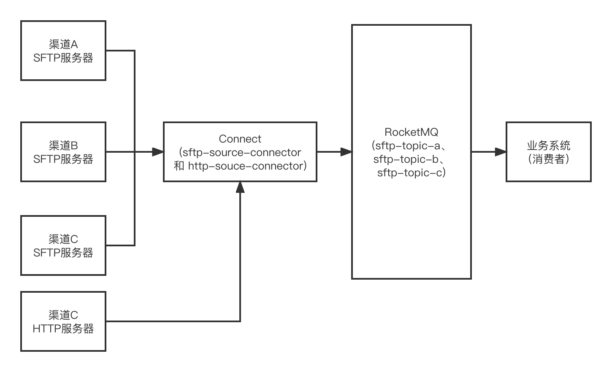

<!-- TOC -->

- [connect **介绍**](#connect-介绍)
- [SFTP 介绍](#sftp-介绍)
- [connect-sftp 使用场景](#connect-sftp-使用场景)
  - [使用 sftp-source-connector 同步对账文件](#使用-sftp-source-connector-同步对账文件)
  - [使用 sftp-sink-connector 生成对账文件](#使用-sftp-sink-connector-生成对账文件)
  - [使用 sftp-sink-connector 和 sftp-source-connector 同步 sftp 文件](#使用-sftp-sink-connector-和-sftp-source-connector-同步-sftp-文件)
- [connect-sftp 演示](#connect-sftp-演示)
- [参考](#参考)

<!-- TOC -->

## connect **介绍**

* 基于 openMessage connect 标准之上。实现了对 Connector 的管理（Rest API、Shell Command）
* 实现了对 task 的任务调度
* 通过插件机制和继承的扩展方式，使得扩展 connect 支持各种不同的应用协议变得比较轻量和容易。

## SFTP 介绍

全称 SSH File Transfer Protocol，运行在 SSH 协议之上（与 FTP 没有任何共同点），用于文件的传输。

## connect-sftp 使用场景

### 使用 sftp-source-connector 同步对账文件

使用 sftp-source-connector 同步对账文件到 MQ，业务系统对接MQ，消费相应主题的消息进行业务处理。

优势：

* 借助MQ，业务系统作为消费者可以轻松实现负载均衡
* 业务系统不必关心数据的读取和转换过程。该过程的可靠性由 connect 保证。

劣势：

* 需要独立部署一个 connect 服务，并做相应的维护和配置。

### 使用 sftp-sink-connector 生成对账文件

### 使用 sftp-sink-connector 和 sftp-source-connector 同步 sftp 文件

## connect-sftp 演示

[RocketMQ Connect SFTP 实战.md](RocketMQ Connect SFTP 实战.md)

## 参考

[sftp.net](https://www.sftp.net/)